# Authentication & Authorization

## Overview

Comprehensive security documentation for authentication and authorization in the Fullstack Online Shop.

---

## Authentication Strategy

### JWT (JSON Web Tokens)

The application uses JWT for stateless authentication.

**Benefits:**
- Stateless (no server-side session storage)
- Scalable across multiple servers
- Includes user information in token
- Industry-standard security

**Implementation:** Passport JWT strategy with `@nestjs/passport`

---

## Authentication Flow

### Registration Flow

```mermaid
sequenceDiagram
    participant User
    participant Frontend
    participant Backend
    participant Database

    User->>Frontend: Fill registration form
    Frontend->>Backend: POST /auth/register
    Backend->>Backend: Validate input
    Backend->>Backend: Hash password (bcrypt)
    Backend->>Database: Save customer
    Database-->>Backend: Customer created
    Backend->>Backend: Generate JWT token
    Backend-->>Frontend: { access_token, customer }
    Frontend->>Frontend: Store token in localStorage
    Frontend-->>User: Registration success
```



### Login Flow


### Protected Request Flow


---

## Backend Implementation

### Password Hashing

```typescript
// backend/src/customers/customers.service.ts
import * as bcrypt from 'bcrypt';

const SALT_ROUNDS = 12;

// Hash password during registration
const hashedPassword = await bcrypt.hash(createDto.password, SALT_ROUNDS);

// Verify password during login
const isMatch = await bcrypt.compare(plainPassword, hashedPassword);
```

**Security:**
- ✅ Uses bcrypt (industry standard)
- ✅ Salt rounds: 12 (secure)
- ✅ Passwords never stored in plain text
- ✅ Constant-time comparison prevents timing attacks

### JWT Token Generation

```typescript
// backend/src/auth/auth.service.ts
import { JwtService } from '@nestjs/jwt';

async login(customer: Customer) {
  const payload: JwtPayload = {
    sub: customer.id,
    email: customer.email,
    name: customer.name,
  };

  return {
    access_token: this.jwtService.sign(payload),
    customer: {
      id: customer.id,
      email: customer.email,
      name: customer.name,
    },
  };
}
```

### JWT Strategy

```typescript
// backend/src/auth/jwt.strategy.ts
import { Injectable } from '@nestjs/common';
import { PassportStrategy } from '@nestjs/passport';
import { ExtractJwt, Strategy } from 'passport-jwt';

@Injectable()
export class JwtStrategy extends PassportStrategy(Strategy) {
  constructor() {
    super({
      jwtFromRequest: ExtractJwt.fromAuthHeaderAsBearerToken(),
      ignoreExpiration: false,
      secretOrKey: process.env.JWT_SECRET,
    });
  }

  async validate(payload: JwtPayload): Promise<AuthUser> {
    return {
      id: payload.sub,
      email: payload.email,
      name: payload.name,
    };
  }
}
```

### JWT Guard

```typescript
// backend/src/auth/guards/jwt-auth.guard.ts
import { Injectable } from '@nestjs/common';
import { AuthGuard } from '@nestjs/passport';

@Injectable()
export class JwtAuthGuard extends AuthGuard('jwt') {}
```

### Protecting Routes

```typescript
// backend/src/orders/orders.controller.ts
import { UseGuards } from '@nestjs/common';
import { JwtAuthGuard } from '../auth/guards/jwt-auth.guard';
import { CurrentUser } from '../auth/decorators/current-user.decorator';

@Controller('orders')
export class OrdersController {
  // ✅ Protected route
  @Post()
  @UseGuards(JwtAuthGuard)
  create(
    @Body() createOrderDto: CreateOrderDto,
    @CurrentUser() user: AuthUser,
  ) {
    // user is available from JWT token
    return this.ordersService.create(createOrderDto);
  }

  // ❌ Public route (no guard)
  @Get()
  findAll() {
    return this.ordersService.findAll();
  }
}
```

### Current User Decorator

```typescript
// backend/src/auth/decorators/current-user.decorator.ts
import { createParamDecorator, ExecutionContext } from '@nestjs/common';

export const CurrentUser = createParamDecorator(
  (data: unknown, ctx: ExecutionContext) => {
    const request = ctx.switchToHttp().getRequest();
    return request.user;  // Attached by JWT strategy
  },
);
```

---

## Frontend Implementation

### Auth Context

```typescript
// frontend/src/context/AuthContext.tsx
'use client';

import { createContext, useContext, useState, useEffect } from 'react';

interface User {
  id: number;
  email: string;
  name: string;
}

interface AuthContextType {
  user: User | null;
  login: (email: string, password: string) => Promise<void>;
  register: (email: string, name: string, password: string) => Promise<void>;
  logout: () => void;
  isAuthenticated: boolean;
}

const AuthContext = createContext<AuthContextType | undefined>(undefined);

export function AuthProvider({ children }: { children: React.ReactNode }) {
  const [user, setUser] = useState<User | null>(null);
  const [token, setToken] = useState<string | null>(null);

  // Load user from localStorage on mount
  useEffect(() => {
    const storedToken = localStorage.getItem('access_token');
    const storedUser = localStorage.getItem('user');
    
    if (storedToken && storedUser) {
      setToken(storedToken);
      setUser(JSON.parse(storedUser));
    }
  }, []);

  const login = async (email: string, password: string) => {
    const response = await fetch('http://localhost:3001/auth/login', {
      method: 'POST',
      headers: { 'Content-Type': 'application/json' },
      body: JSON.stringify({ email, password }),
    });

    if (!response.ok) {
      throw new Error('Invalid credentials');
    }

    const data = await response.json();
    
    // Store token and user
    localStorage.setItem('access_token', data.access_token);
    localStorage.setItem('user', JSON.stringify(data.customer));
    
    setToken(data.access_token);
    setUser(data.customer);
  };

  const register = async (email: string, name: string, password: string) => {
    const response = await fetch('http://localhost:3001/auth/register', {
      method: 'POST',
      headers: { 'Content-Type': 'application/json' },
      body: JSON.stringify({ email, name, password }),
    });

    if (!response.ok) {
      const error = await response.json();
      throw new Error(error.message || 'Registration failed');
    }

    const data = await response.json();
    
    localStorage.setItem('access_token', data.access_token);
    localStorage.setItem('user', JSON.stringify(data.customer));
    
    setToken(data.access_token);
    setUser(data.customer);
  };

  const logout = () => {
    localStorage.removeItem('access_token');
    localStorage.removeItem('user');
    setToken(null);
    setUser(null);
  };

  return (
    <AuthContext.Provider
      value={{
        user,
        login,
        register,
        logout,
        isAuthenticated: !!user,
      }}
    >
      {children}
    </AuthContext.Provider>
  );
}

export const useAuth = () => {
  const context = useContext(AuthContext);
  if (!context) {
    throw new Error('useAuth must be used within AuthProvider');
  }
  return context;
};
```

### API Client with Authentication

```typescript
// frontend/src/lib/api.ts
const API_URL = process.env.NEXT_PUBLIC_API_URL || 'http://localhost:3001';

function getAuthHeaders(): HeadersInit {
  const token = localStorage.getItem('access_token');
  
  return {
    'Content-Type': 'application/json',
    ...(token && { Authorization: `Bearer ${token}` }),
  };
}

// Authenticated request
export async function createOrder(orderData: CreateOrderDto) {
  const response = await fetch(`${API_URL}/orders`, {
    method: 'POST',
    headers: getAuthHeaders(),  // Includes Bearer token
    body: JSON.stringify(orderData),
  });

  if (response.status === 401) {
    // Token expired or invalid
    localStorage.removeItem('access_token');
    localStorage.removeItem('user');
    window.location.href = '/auth/login';
    throw new Error('Authentication required');
  }

  if (!response.ok) {
    throw new Error('Failed to create order');
  }

  return response.json();
}
```

---

## Authorization Patterns

### Role-Based Access Control (RBAC)

**Future Enhancement:** Add roles to customers

```typescript
// backend/src/customers/entities/customer.entity.ts
@Entity('customers')
export class Customer {
  @PrimaryGeneratedColumn()
  id: number;

  @Column()
  email: string;

  @Column()
  name: string;

  @Column()
  password: string;

  @Column({ type: 'enum', enum: ['user', 'admin'], default: 'user' })
  role: string;  // Add role field

  @CreateDateColumn()
  createdAt: Date;

  @UpdateDateColumn()
  updatedAt: Date;
}
```

### Roles Guard

```typescript
// backend/src/auth/guards/roles.guard.ts
import { Injectable, CanActivate, ExecutionContext } from '@nestjs/common';
import { Reflector } from '@nestjs/core';

@Injectable()
export class RolesGuard implements CanActivate {
  constructor(private reflector: Reflector) {}

  canActivate(context: ExecutionContext): boolean {
    const requiredRoles = this.reflector.get<string[]>(
      'roles',
      context.getHandler(),
    );
    
    if (!requiredRoles) {
      return true;  // No roles required
    }

    const request = context.switchToHttp().getRequest();
    const user = request.user;

    return requiredRoles.includes(user.role);
  }
}
```

### Roles Decorator

```typescript
// backend/src/auth/decorators/roles.decorator.ts
import { SetMetadata } from '@nestjs/common';

export const Roles = (...roles: string[]) => SetMetadata('roles', roles);
```

### Using Roles

```typescript
// backend/src/products/products.controller.ts
import { UseGuards } from '@nestjs/common';
import { JwtAuthGuard } from '../auth/guards/jwt-auth.guard';
import { RolesGuard } from '../auth/guards/roles.guard';
import { Roles } from '../auth/decorators/roles.decorator';

@Controller('products')
@UseGuards(JwtAuthGuard, RolesGuard)
export class ProductsController {
  // Only admins can create products
  @Post()
  @Roles('admin')
  create(@Body() createProductDto: CreateProductDto) {
    return this.productsService.create(createProductDto);
  }

  // Anyone can view products
  @Get()
  findAll() {
    return this.productsService.findAll();
  }
}
```

---

## Security Best Practices

### Token Security

**✅ DO:**
- Use strong JWT secrets (32+ characters)
- Set appropriate token expiration (1h - 1 day)
- Validate token on every request
- Store tokens securely (httpOnly cookies preferred over localStorage)
- Include minimal data in token payload
- Rotate secrets periodically

**❌ DON'T:**
- Store sensitive data in JWT payload (it's base64 encoded, not encrypted)
- Use predictable secrets
- Set excessively long expiration times
- Share tokens between users
- Log tokens in server logs

### Password Security

**✅ DO:**
- Use bcrypt or argon2 for hashing
- Use 10-12 salt rounds (balance security vs performance)
- Enforce strong password requirements
- Never log passwords
- Hash passwords before database storage
- Use constant-time comparison

**❌ DON'T:**
- Store plain text passwords
- Use MD5 or SHA1 (broken algorithms)
- Use custom encryption schemes
- Allow weak passwords
- Return passwords in API responses

### API Security

**✅ DO:**
- Validate all inputs
- Use HTTPS in production
- Implement rate limiting
- Add CORS configuration
- Use helmet for security headers
- Log authentication failures
- Implement account lockout after failed attempts

**❌ DON'T:**
- Trust client-side validation alone
- Expose detailed error messages
- Allow unlimited login attempts
- Use HTTP in production
- Skip input sanitization

---

## Token Refresh (Future Enhancement)

### Refresh Token Strategy

```typescript
// backend/src/auth/auth.service.ts
async login(customer: Customer) {
  const accessToken = this.jwtService.sign(
    { sub: customer.id, email: customer.email },
    { expiresIn: '15m' },  // Short-lived access token
  );

  const refreshToken = this.jwtService.sign(
    { sub: customer.id },
    { expiresIn: '7d' },  // Long-lived refresh token
  );

  // Store refresh token in database
  await this.storeRefreshToken(customer.id, refreshToken);

  return { access_token: accessToken, refresh_token: refreshToken };
}

async refreshAccessToken(refreshToken: string) {
  // Validate refresh token
  const payload = this.jwtService.verify(refreshToken);
  
  // Check if token exists in database
  const isValid = await this.validateRefreshToken(payload.sub, refreshToken);
  
  if (!isValid) {
    throw new UnauthorizedException('Invalid refresh token');
  }

  // Generate new access token
  const accessToken = this.jwtService.sign({
    sub: payload.sub,
    email: payload.email,
  });

  return { access_token: accessToken };
}
```

---

## Related Documentation

- [Security Guidelines](guidelines.md)
- [Data Protection](data-protection.md)
- [API Authentication](../api/auth.md)
- [Environment Variables](../development/environment-variables.md)
